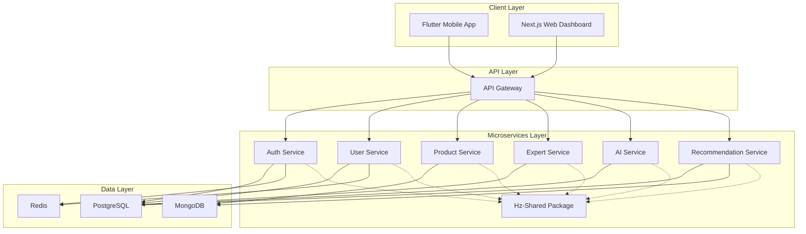

# AI Skincare Platform - System Architecture

## Tổng quan kiến trúc
AI Skincare Platform được thiết kế theo mô hình microservices với kiến trúc phân tán, đảm bảo khả năng mở rộng, bảo trì và hiệu suất cao. Hệ thống bao gồm các thành phần chính: Client Applications, API Gateway, Microservices, và Data Layer.

## Kiến trúc tổng thể

### 1. Client Layer (Tầng ứng dụng khách)
- **Flutter Mobile App**: Ứng dụng di động chính cho người dùng cuối, hỗ trợ camera integration, AI analysis interface, product recommendation, expert consultation booking
- **Next.js Web Dashboard**: Portal quản lý cho chuyên gia và admin, cung cấp dashboard, analytics, user management, product catalog management

### 2. API Gateway
- **Node.js + Express Gateway**: Single entry point cho tất cả client requests, thực hiện request routing, authentication, rate limiting, logging, load balancing

### 3. Microservices Layer
- **Auth Service**: Node.js + TypeScript, xử lý xác thực người dùng, JWT token management, quản lý phiên làm việc
- **User Service**: Node.js + TypeScript, quản lý user registration/auth, profile management, analysis history, lifestyle goals, reminders
- **Product Service**: Node.js + TypeScript, quản lý product catalog, inventory, partner integration
- **Expert Service**: Node.js + TypeScript, quản lý expert profiles, consultation scheduling, review system
- **AI Service**: Python + FastAPI, xử lý skin image analysis sử dụng Google Gemini API, image preprocessing, analysis result generation
- **Recommendation Service**: Python + FastAPI, ML-based product recommendations với collaborative và content-based filtering

### 4. Shared Package
- **hz-shared**: Thư viện chia sẻ giữa các dịch vụ Node.js, bao gồm:
  - Xử lý lỗi chung
  - JWT utilities
  - PostgreSQL utilities
  - Validation utilities

### 5. Data Layer
- **PostgreSQL**: Dữ liệu quan hệ với ACID compliance (users, analyses, consultations, reviews, authentication)
- **MongoDB**: Dữ liệu dạng document với schema linh hoạt (products, categories, brands, ingredients)
- **Redis**: Caching hiệu suất cao và session storage

### 6. Infrastructure & DevOps
- **Containerization**: Docker + Docker Compose với health checks, service dependencies
- **CI/CD Pipeline**: GitHub Actions với automated testing, security scanning, deployment staging
- **Monitoring**: Logging và monitoring cơ bản

### 7. Security Architecture
- **Authentication & Authorization**: JWT tokens, refresh tokens
- **Data Protection**: Encryption cho dữ liệu nhạy cảm, bảo mật API endpoints

### 8. Performance Optimization
- **Caching Strategy**: Redis cho session và caching hiệu suất cao
- **Database Optimization**: Connection pooling, indexing, query optimization
- **API Performance**: Rate limiting, response optimization

### 9. Scalability Design
- **Horizontal Scaling**: Independent scaling per service, load balancing
- **Database Scaling**: PostgreSQL connection pooling, Redis caching

## Mối quan hệ giữa các dịch vụ

## Đặc điểm thiết kế nổi bật

### 1. Tách biệt trách nhiệm
- Mỗi dịch vụ chịu trách nhiệm cho một chức năng kinh doanh cụ thể
- Giảm coupling giữa các thành phần hệ thống

### 2. Tính mở rộng
- Kiến trúc microservices cho phép mở rộng từng dịch vụ độc lập
- Dễ dàng thêm chức năng mới mà không ảnh hưởng đến toàn hệ thống

### 3. Tính bảo trì
- Mỗi dịch vụ có thể được phát triển, test và deploy độc lập
- Dễ dàng cập nhật và bảo trì từng phần của hệ thống

### 4. Tính sẵn sàng
- Service isolation giúp giảm thiểu tác động khi một dịch vụ gặp sự cố
- Có thể triển khai các chiến lược phục hồi lỗi riêng cho từng dịch vụ

Kiến trúc này được thiết kế để đảm bảo scalability, reliability, security và maintainability cho AI Skincare Platform, có thể xử lý từ MVP đến production scale.